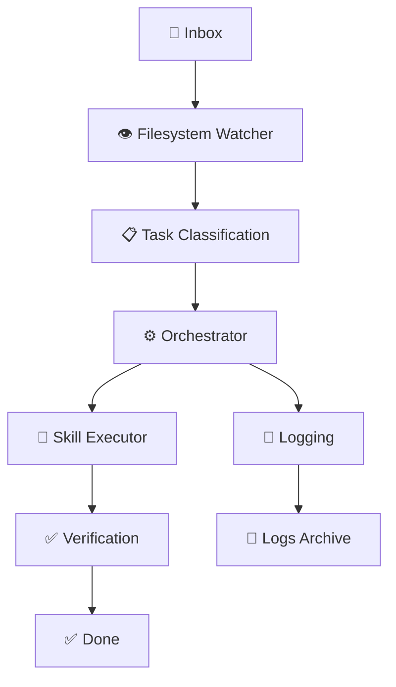

# 🤖 Personal AI Employee

> 🚀 **Local-First AI Employee System** — A production-ready, constitutional AI employee that operates autonomously on your local machine with full auditability, skill architecture, and governance framework.

<div align="center">

[](https://opensource.org/licenses/MIT)
[](https://www.python.org/downloads/)
[](https://github.com)
[](https://github.com)
[](https://github.com)

</div>

<div align="center">
  <sub>Built with ❤️ for autonomous, trustworthy AI workflows</sub>
</div>

<br>

## 🌟 **What is Personal AI Employee?**

The **Personal AI Employee** is a revolutionary, production-ready AI system that brings enterprise-grade automation to your personal workspace. Designed with constitutional governance and skill-based architecture, it operates as a true digital employee that processes tasks autonomously while maintaining complete data privacy and full auditability.

## 🎯 **Core Purpose**

Transform your personal and professional workflows with an AI employee that:
- ✅ **Respects Privacy**: All data stays local - no cloud leakage
- ✅ **Follows Rules**: Constitutional governance prevents unauthorized actions
- ✅ **Learns & Grows**: Skill-based architecture for continuous capability expansion
- ✅ **Audits Everything**: Complete traceability and accountability
- ✅ **Requires No Supervision**: Autonomous operation with safety nets

## 🏗️ **System Architecture**

### **🎯 Constitutional Framework**
The system operates under immutable constitutional rules defined in `Company_Handbook.md`, ensuring the AI never violates established boundaries.

### **🔄 Core Pipeline**
```
📁 Inbox → 👁️ Watcher → ⏳ Needs_Action → ⚙️ Orchestrator → 🤖 Skills → ✅ Done
```

### **🛠️ Skill Architecture**
Modular skill system with inheritance, chaining, and governance:
- **SK-BASE**: Universal contract for all skills
- **SK-010**: File intake and validation
- **SK-011**: Task lifecycle management
- **SK-012**: Primary reasoning and execution

### **📊 Governance & Safety**
- **4-Tier Approval System**: From autonomous (Tier 0) to restricted (Tier 3)
- **E1-E4 Error Classification**: Progressive escalation protocols
- **Stale Loop Protection**: Automatic halting for infinite cycles
- **Secret Detection**: Halts processing if sensitive data detected

## 📈 **Development Tiers**

| Tier | Name | Status | Features | Focus |
|------|------|--------|----------|-------|
| 🥉 **Bronze** | Foundation | ✅ Complete | Core pipeline, constitutional governance | **Stable Base** |
| 🥈 **Silver** | Expansion | 🚧 Planned | Advanced skill chaining, planning | **Enhanced Capabilities** |
| 🥇 **Gold** | Enterprise | 🚧 Planned | Multi-agent coordination, complex workflows | **Professional Scale** |

### ** bronze-tier Features:**
- ✅ Constitutional AI governance
- ✅ Skill-based architecture
- ✅ Filesystem monitoring
- ✅ Task lifecycle management
- ✅ Complete audit trail
- ✅ Error handling & recovery
- ✅ Local-first operation

## 🔄 **Workflow Process**

### **Task Lifecycle**
1. 📥 **Inbox**: Task files enter the system (`.md`, `.txt`, `.json`, etc.)
2. 👁️ **File Processor**: Validates, classifies, and prioritizes tasks
3. ⏳ **Task Manager**: Routes to appropriate skill with metadata
4. 🤖 **Orchestrator**: Executes through 7-step reasoning loop
5. ✅ **Completion**: Task marked complete only after verification
6. 📝 **Logging**: Full audit trail in `/Logs` directory

### **Skill Execution Flow**
```
Detect → Validate → Authorize → Prepare → Execute → Log → Output → Verify
```

## 📊 **Tier Progression**

### ** Bronze Tier Implementation**


### **Constitutional Framework**
The `Company_Handbook.md` serves as the immutable constitution with these core principles:

| Section | Purpose | Key Features |
|---------|---------|--------------|
| **Communication Style** | Defines AI interaction patterns | Professional, clear, structured |
| **Approval Rules** | 4-tier governance system | Tier 0-3 with clear boundaries |
| **Task Lifecycle** | Standardized task processing | Frontmatter-driven workflow |
| **Logging Requirements** | Audit trail standards | 11 mandatory events logged |
| **Error Handling** | Failure management | E1-E4 classification, max 3 retries |
| **Daily Self-Check** | System verification | 6-point health check |

## 🎓 **Learning Value**

This project provides hands-on experience with:

### **AI Engineering**
- Constitutional AI governance
- Skill-based architecture design
- Prompt engineering for task execution
- Local-first AI deployment

### **Software Architecture**
- Event-driven systems
- File-based state management
- Pipeline architecture
- Error handling & resilience

### **DevOps & Operations**
- Local-first deployment patterns
- Audit & compliance systems
- Monitoring & logging
- Automated task processing

### **Security & Governance**
- Data privacy in AI systems
- Rule enforcement mechanisms
- Safety nets & circuit breakers
- Audit trail maintenance

## 🚀 **Getting Started**

### **Prerequisites**
- Python 3.8+
- Claude API key (optional for local simulation)
- Git

### **Quick Setup**
```bash
# Clone the repository
git clone https://github.com/asadshabir/Personal-AI-Employee.git
cd Personal-AI-Employee

# Navigate to Bronze Tier
cd "Bronze Tier"

# Start filesystem watcher (monitors Inbox)
python filesystem_watcher.py

# In another terminal, start orchestrator (processes tasks)
python orchestrator.py
```

### **Task Submission**
1. Create a task file in the `/Inbox` directory
2. The `filesystem_watcher.py` automatically detects and processes it
3. Monitor the process in `/Needs_Action`, `/Done`, and `/Logs`

## 📁 **Directory Structure**

```
📁 Personal AI Employee/
├── 📄 README.md                 # Project documentation
├── 📁 Bronze Tier/              # 🥉 Foundation system
│   ├── 🏠 AI_Employee.code-workspace    # VS Code configuration
│   ├── 📚 Company_Handbook.md           # Constitutional governance
│   ├── 👁️ filesystem_watcher.py        # Task intake system
│   ├── ⚙️ orchestrator.py               # Central execution engine
│   ├── 📋 Dashboard/                   # Command center
│   ├── 📥 Inbox/                       # Incoming tasks
│   ├── ⏳ Needs_Action/                # Pending queue
│   ├── ✅ Done/                        # Completed tasks
│   ├── 📝 Logs/                        # Audit trail
│   ├── 📋 Plans/                       # Generated plans
│   └── 🛠️ Skills/                      # Skill architecture
│       ├── 🎯 SKILL_INDEX.md           # Skill registry
│       ├── ⚖️ Skill_Base.md             # Universal contract (SK-BASE)
│       ├── 📂 Skill_File_Processor.md   # Task intake (SK-010)
│       ├── 📂 Skill_Task_Manager.md     # Lifecycle (SK-011)
│       └── 🧠 Skill_Task_Executor.md    # Reasoning loop (SK-012)
```

## 🛠️ **Core Components**

| Component | Purpose | Key Features |
|-----------|---------|--------------|
| **Company Handbook** | Constitutional rules | Immutable governance, 4-tier approval |
| **Filesystem Watcher** | Task intake | Polling-based, collision-safe, secret detection |
| **Orchestrator** | Task execution | Completion-driven, retry policy, skill routing |
| **Skill Architecture** | Modular capabilities | Inheritance, chaining, verification |
| **Logging System** | Audit trail | Full traceability, retention policies |

## 📈 **Use Cases**

### **Personal Productivity**
- Automated report generation
- Document processing and categorization
- Task management and scheduling
- Research and data collection

### **Professional Workflows**
- Code review assistance
- Documentation maintenance
- Data analysis and reporting
- Meeting summary generation

### **Learning & Development**
- AI interaction experimentation
- Skill architecture practice
- Constitutional AI governance
- Local-first AI deployment

## 🚨 **Safety & Security**

### **Governance Features**
- **Immutable Constitution**: Company Handbook cannot be modified by AI
- **Tiered Access Control**: 4-tier approval system with clear boundaries
- **Error Classification**: E1-E4 severity with appropriate responses
- **Secret Detection**: Halts processing if sensitive data detected

### **Audit & Compliance**
- **Complete Traceability**: Every action logged with context
- **Append-Only History**: No file overwrites or deletions
- **Stale Loop Protection**: Automatic detection of infinite cycles
- **Verification Requirements**: Tasks complete only after checklist

## 🤝 **Contributing**

We welcome contributions that enhance the system's capabilities while maintaining its core principles:

1. 🍴 **Fork** the repository
2. 🌱 **Create** a feature branch (`git checkout -b feature/amazing-skill`)
3. ✍️ **Commit** your changes (`git commit -m 'Add amazing skill'`)
4. 🚀 **Push** to the branch (`git push origin feature/amazing-skill`)
5. 🔄 **Open** a Pull Request

### **Contribution Guidelines**
- Maintain constitutional governance principles
- Follow skill architecture patterns
- Include comprehensive logging
- Add unit and integration tests

## 📄 **License**

This project is licensed under the MIT License - see the [LICENSE](LICENSE) file for details.

## 💡 **Acknowledgments**

- **Anthropic Claude**: For the powerful AI reasoning engine
- **Local-First Philosophy**: For inspiring privacy-conscious design
- **Constitutional AI**: For governance and safety frameworks
- **Open Source Community**: For continuous inspiration and improvement

## 🎯 **Future Roadmap**

### **Silver Tier Enhancements**
- Advanced skill chaining capabilities
- Enhanced planning and forecasting
- Improved error recovery mechanisms
- Multi-model support

### **Gold Tier Goals**
- Multi-agent coordination
- Complex workflow management
- Enterprise-grade features
- Advanced security protocols

---

<div align="center">

> 🚀 **Ready to experience the future of personal AI automation?**
> Deploy your own constitutional AI employee today!

</div>